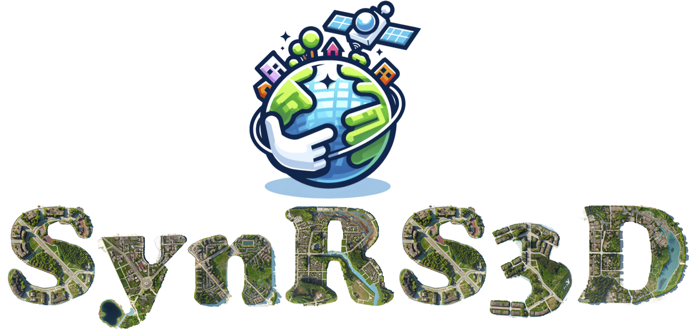
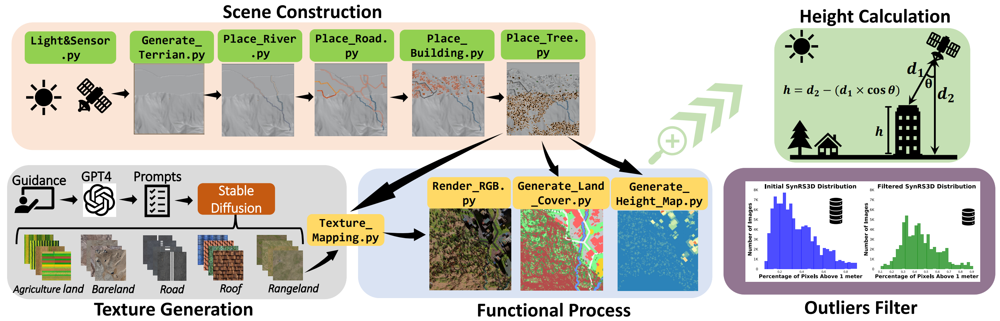
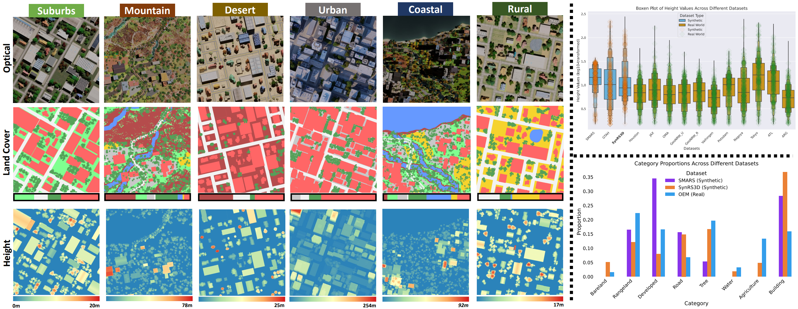
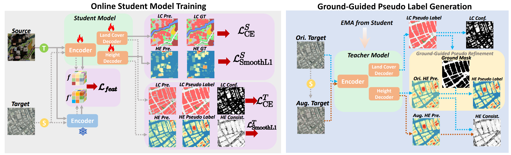
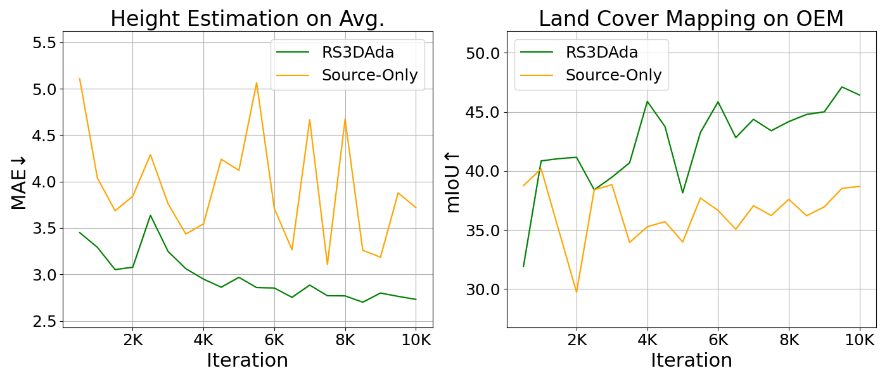

<div align="center">
    <h1 align="center">
        
    </h1>
    <h3>SynRS3D: A Synthetic Dataset for Global 3D Semantic Understanding from Monocular Remote Sensing Imagery</h3>
    <p><strong>NeurIPS 2024 Spotlight</strong></p>


[Jian Song](https://jtrneo.github.io/)<sup>1,2</sup>, [Hongruixuan Chen](https://scholar.google.ch/citations?user=XOk4Cf0AAAAJ&hl=zh-CN&oi=ao)<sup>1</sup>, [Weihao Xuan](https://weihaoxuan.com/)<sup>1,2</sup>, [Junshi Xia](https://scholar.google.com/citations?user=n1aKdTkAAAAJ&hl=en)<sup>2</sup>, [Naoto Yokoya](https://scholar.google.co.jp/citations?user=DJ2KOn8AAAAJ&hl=en)<sup>1,2</sup>

<sup>1</sup> The University of Tokyo, <sup>2</sup> RIKEN AIP

[](https://jtrneo.github.io/SynRS3D/) [](https://arxiv.org/pdf/2406.18151) [](https://zenodo.org/records/13905264) [](https://zenodo.org/records/13940407)


</div>

## 🔭 Overview

### SynRS3D: Largest Remote Sensing Synthetic Dataset

 **SynRS3D** is a high-quality, high-resolution synthetic remote sensing (RS) dataset designed to enhance global 3D semantic understanding. It contains 69,667 images with ground sampling distances (GSD) ranging from 0.05 to 1 meter, and provides annotations for height estimation, land cover mapping, and building change detection across a wide variety of scenes.

<p align="center">
  
  
</p>

### RS3DAda: UDA & DG Multi-Task Baseline Method in RS

**RS3DAda** is a novel unsupervised domain adaptation (UDA) and domain generalization (DG) multi-task baseline, designed for transferring knowledge from synthetic to real remote sensing data.

<p align="center">
  
</p>

## 🛎️Updates
* **` Oct 10th, 2024`**: Codes and data are ready! You are welcome to use it.
* **` Sep 27th, 2024`**: Codes and data are coming soon! Please stay tuned!!
* **` Sep 26th, 2024`**: SynRS3D has been accepted at NeurIPS D&B Track 2024 as a **Spotlight**!!

## ✅ To-Do List

- [ ] Release the SynRS3D generation code
- [ ] Release the building change detection code
- [x] Release the SynRS3D dataset
- [x] Release the RS3DAda code

## ⚙️  Installation
Note that the code in this repo runs under **Linux** system. We have not tested whether it works under other OS.

1. **Clone this repository:**

    ```bash
    git clone https://github.com/JTRNEO/SynRS3D.git
    cd SynRS3D
    ```

2. **Create and activate the conda environment:**

    ```bash
    conda create -n synrs3d python=3.8
    conda activate synrs3d
    conda install pytorch=2.2.1 torchvision=0.17.1 torchaudio=2.2.1 pytorch-cuda=11.8 -c pytorch -c nvidia
    conda install gdal
    pip install albumentations tqdm ever-beta==0.2.3 huggingface_hub rasterio
    ```

## 💾 Datasets Preparation

### Download the SynRS3D dataset:

- **SynRS3D:** [](https://zenodo.org/records/13905264)

    Place all zip files under `./SynRS3D/data` and extract them.

### Real-World Elevation Datasets

Here is the table of real-world elevation datasets we used:

| **Types**          | **Datasets**     | **Data Source**                                                                                             | **License/Conditions of Use**                                    |
|--------------------|------------------|-------------------------------------------------------------------------------------------------------------|------------------------------------------------------------------|
| **Target Domain 1** | DFC18            | [2018 IEEE GRSS Data Fusion Challenge](https://ieee-dataport.org/open-access/2018-ieee-grss-data-fusion-challenge-%E2%80%93-fusion-multispectral-lidar-and-hyperspectral-data) | [Creative Commons Attribution](https://creativecommons.org/licenses/by/4.0/) |
|                    | DFC19_JAX        | [Data Fusion Contest 2019](https://ieee-dataport.org/open-access/data-fusion-contest-2019-dfc2019)          | [Creative Commons Attribution](https://creativecommons.org/licenses/by/4.0/) |
|                    | DFC19_OMA        | [Data Fusion Contest 2019](https://ieee-dataport.org/open-access/data-fusion-contest-2019-dfc2019)          | [Creative Commons Attribution](https://creativecommons.org/licenses/by/4.0/) |
|                    | geonrw_urban     | [GeoNRW](https://ieee-dataport.org/open-access/geonrw)                                                      | [Creative Commons Attribution](https://creativecommons.org/licenses/by/4.0/) |
|                    | geonrw_rural     | [GeoNRW](https://ieee-dataport.org/open-access/geonrw)                                                      | [Creative Commons Attribution](https://creativecommons.org/licenses/by/4.0/) |
|                    | Potsdam          | [ISPRS](https://www.isprs.org/education/benchmarks/UrbanSemLab/2d-sem-label-potsdam.aspx)                   | Redistribution is not allowed                          |
| **Target Domain 2** | OGC_ATL          | [Overhead Geopose Challenge](https://www.drivendata.org/competitions/78/overhead-geopose-challenge/page/394/) | [Creative Commons Attribution](https://creativecommons.org/licenses/by/4.0/) |
|                    | OGC_ARG          | [Overhead Geopose Challenge](https://www.drivendata.org/competitions/78/overhead-geopose-challenge/page/394/) | [Creative Commons Attribution](https://creativecommons.org/licenses/by/4.0/) |
|                    | Vaihingen        | [ISPRS](https://www.isprs.org/education/benchmarks/UrbanSemLab/2d-sem-label-vaihingen.aspx)                 | Redistribution is not allowed                          |
|                    | Nagoya           | [NTT DATA Corporation and Inc. DigitalGlobe](https://www.nttdata.com/global/en/news/press-release/2017/february/digitalglobe-and-ntt-data-corporation-announce-partnership-to-expand-usage-of-elevation-data) | End User License Agreement (Commercial)                                         |
|                    | Tokyo            | [NTT DATA Corporation and Inc. DigitalGlobe](https://www.nttdata.com/global/en/news/press-release/2017/february/digitalglobe-and-ntt-data-corporation-announce-partnership-to-expand-usage-of-elevation-data) | End User License Agreement (Commercial)                                        |

❗❗❗ We provide those redistributable datasets that have been preprocessed by ourselves. For datasets like ISPRS, which do not allow redistribution, we provide a script to process them in ```./prepare_ISPRS_datasets```. For commercial datasets like Nagoya and Tokyo, we cannot provide them directly.

### (Optional) Land Cover Mapping Real-World Dataset

For land cover mapping, we used the OpenEarthMap dataset. Please download it from the following link and reorganize it with the same structure as SynRS3D:

- [OpenEarthMap](https://zenodo.org/records/7223446)

### Redistributable Datasets Download Links
The redistributable datasets can be downloaded from the links provided below:

- **DFC18 (Houston dataset):** [Google Drive](https://drive.google.com/file/d/1rq8w7YT25y2kxxRhuIpI68QeZmX1GZ0F/view?usp=sharing)

    Place all zip files under `./SynRS3D/data` and extract them.
- **DFC19 (JAX & OMA):** [Google Drive](https://drive.google.com/file/d/1eoF16sxIHOQ5928SrboMqbi686sfKFLF/view?usp=sharing)
    - ***DFC19 (JAX & OMA):***  After downloading, place the files in `./SynRS3D/data` and extract them. In the folders `./SynRS3D/data/DFC19_JAX` and `./SynRS3D/data/DFC19_OMA`, we have prepared training and testing lists for JAX and OMA, respectively. Please use the following soft link commands to set up the DFC19 dataset:

        ```bash
        ln -s /your/project/path/SynRS3D/data/DFC19/opt /your/project/path/SynRS3D/data/DFC19_JAX/opt

        ln -s /your/project/path/SynRS3D/data/DFC19/gt_ss_mask /your/project/path/SynRS3D/data/DFC19_JAX/gt_ss_mask

        ln -s /your/project/path/SynRS3D/data/DFC19/gt_nDSM /your/project/path/SynRS3D/data/DFC19_JAX/gt_nDSM
        ```

        ```bash
        ln -s /your/project/path/SynRS3D/data/DFC19/opt /your/project/path/SynRS3D/data/DFC19_OMA/opt

        ln -s /your/project/path/SynRS3D/data/DFC19/gt_ss_mask /your/project/path/SynRS3D/data/DFC19_OMA/gt_ss_mask

        ln -s /your/project/path/SynRS3D/data/DFC19/gt_nDSM /your/project/path/SynRS3D/data/DFC19_OMA/gt_nDSM
        ```
        This will create the necessary symbolic links for the DFC19 dataset setup.
- **GeoNRW (Rural & Urban):** [Google Drive](https://drive.google.com/file/d/1yWOWpgcpW2JhmBGedNApuzuNspnnVngF/view?usp=sharing)

    - ***GeoNRW (Rural & Urban):***  The original GeoNRW dataset contains more than 120,000 512x512 images. In order to avoid data imbalance, we only selected some cities in our original paper for experimentation and divided them into rural and urban. All DSMs were preprocessed and converted to nDSMs. After downloading, place the files in `./SynRS3D/data` and extract them. In the folders `./SynRS3D/data/geonrw_rural` and `./SynRS3D/data/geonrw_urban`, we have prepared training and testing lists for rural cities and urban cities, respectively. Please use the following soft link commands to set up the GeoNRW dataset:

        ```bash
        ln -s /your/project/path/SynRS3D/data/GeoNRW/opt /your/project/path/SynRS3D/data/geonrw_rural/opt

        ln -s /your/project/path/SynRS3D/data/GeoNRW/gt_nDSM /your/project/path/SynRS3D/data/geonrw_rural/gt_nDSM
        ```

        ```bash
        ln -s /your/project/path/SynRS3D/data/GeoNRW/opt /your/project/path/SynRS3D/data/geonrw_urban/opt

        ln -s /your/project/path/SynRS3D/data/GeoNRW/gt_nDSM /your/project/path/SynRS3D/data/geonrw_urban/gt_nDSM
        ```
        This will create the necessary symbolic links for the GeoNRW dataset setup.

- **OGC_ATL:** [Google Drive](https://drive.google.com/file/d/1tWBfrGKPbrPT1CyXp0iUm6_KItKYuiWb/view?usp=sharing)

    Place all zip files under `./SynRS3D/data` and extract them.

- **OGC_ARG:** [Google Drive](https://drive.google.com/file/d/1eTRYKdqX1Qce0Gq6EsmVQcWoiEioOdSB/view?usp=sharing)

    Place all zip files under `./SynRS3D/data` and extract them.

### Data Structure:

For real-world datasets, the data is expected in the following structure:

```
${DATASET_ROOT} # Dataset root directory, e.g., /home/username/project/SynRS3D/data/DFC19_JAX
├── opt              # RGB images saved as .tif
├── gt_nDSM          # Normalized Digital Surface Model images saved as .tif
├── gt_ss_mask       # Land cover mapping labels saved as .tif (some datasets like DFC18 do not include land cover mapping labels)
├── train.txt        # List of training data names without suffix
└── test.txt         # List of testing data names without suffix
```

For SynRS3D, it contains 17 folders. Download and extract all of them, ensuring each folder follows this structure:

```
${DATASET_ROOT} # Dataset root directory, e.g., /home/username/project/SynRS3D/data/grid_g05_mid_v1
├── opt             # RGB images saved as .tif, also post-event images in building change detection
├── pre_opt         # RGB images saved as .tif, also pre-event images in building change detection
├── gt_nDSM         # Normalized Digital Surface Model images saved as .tif
├── gt_ss_mask      # Land cover mapping labels saved as .tif
├── gt_cd_mask      # Building change detection mask saved as .tif (0 = no change, 255 = change area)
└── train.txt       # List of training data names
```

### Class Mapping for `gt_ss_mask` in the SynRS3D dataset:

- **Bareland:** 1
- **Rangeland:** 2
- **Developed Space:** 3
- **Road:** 4
- **Trees:** 5
- **Water:** 6
- **Agriculture land:** 7
- **Buildings:** 8

## 🤖 Training

Due to restrictions on open-sourcing certain real-world datasets, it may not be possible to reproduce all the exact results from the original paper. However, to assist with reproducibility, we provide results from experiments conducted on redistributable real-world datasets. Below are the key findings.

### Height Estimation Results  
*Best results based on the average of DFC18, DFC19_JAX, DFC19_OMA, geonrw_rural, geonrw_urban, OGC_ARG, and OGC_ATL datasets.*

| Model      | MAE ↓ (Whole) | MAE ↓ (High) | RMSE ↓ (Whole) | RMSE ↓ (High) | F1^HE ↑ (δ < 1.25) | F1^HE ↑ (δ < 1.25^2) | F1^HE ↑ (δ < 1.25^3) |
|------------|---------------|--------------|----------------|---------------|--------------------|----------------------|----------------------|
| **RS3DAda**| 2.534          | 4.961        | 4.122          | 6.242         | 0.467              | 0.605                | 0.672                |
| **Source-Only** | 3.103    | 6.087        | 5.040          | 7.552         | 0.408              | 0.550                | 0.628                |

### Land Cover Mapping Results  
*Best results obtained on the OEM dataset.*

| Class       | Bareland | Rangeland | Developed | Road   | Tree   | Water  | Agriculture | Buildings | **mIoU**   |
|-------------|----------|-----------|-----------|--------|--------|--------|-------------|-----------|------------|
| **RS3DAda** | 7.97%    | 46.34%    | 16.91%    | 44.23% | 62.98% | 70.37% | 70.95%      | 63.02%    | **47.85%** |
| **Source-Only** | 8.69% | 37.95%    | 22.54%    | 49.05% | 60.16% | 46.64% | 35.40%      | 65.19%    | **40.70%** |

The figure below shows the evaluation results over training iterations.

<p align="center"></p>

### Training Scripts
- To train **RS3DAda**, you can use the script:  
  ```bash
  . RS3DAda.sh
  ```
- For **Source-Only** training with SynRS3D, use:  
  ```bash
  . sourceonly.sh
  ```

You should expect results similar to those shown above.

### Notes:
- To evaluate land cover mapping with the OEM dataset, download the dataset from [this link](https://zenodo.org/records/7223446).
- Organize its file structure similarly to **SynRS3D** and enable the `--eval_oem` flag in the script for evaluation.

## 💽 Inference Using Our Best Model
You can find pretrained RS3DAda checkpoints here. At the moment we provide the following model versions:
| Model                                                                  |   Size         |
|--------------------------------------------------------------------------------|----------------|
| [RS3DAda_vitl_DPT_height](https://zenodo.org/records/13940407)                 |  366.54M Params  |
| [RS3DAda_vitl_DPT_segmentation](https://zenodo.org/records/13940407)                 |  366.54M Params  |

Please download and place them in the folder `./SynRS3d/pretrain`.

### Infer Height Maps

To infer height maps using trained RS3DAda on the SynRS3D dataset:

```bash
python infer_height.py \
--data_dir path/to/your/image \
--restore_from ./pretrain/RS3DAda_vitl_DPT_height.pth \
--output_path path/to/your/output \
--use_tta
```

### Infer Land Cover Maps

To infer land cover maps using trained RS3DAda on the SynRS3D dataset:

```bash
python infer_segmentation.py \
--data_dir path/to/your/image \
--restore_from ./pretrain/RS3DAda_vitl_DPT_segmentation.pth \
--output_path path/to/your/output \
--use_tta
```

## 📜Reference

If this code or dataset contributes to your research, please kindly consider citing our paper and give this repo ⭐️ :)
```
@article{song2024synrs3d,
  title={SynRS3D: A Synthetic Dataset for Global 3D Semantic Understanding from Monocular Remote Sensing Imagery},
  author={Song, Jian and Chen, Hongruixuan and Xuan, Weihao and Xia, Junshi and Yokoya, Naoto},
  journal={arXiv preprint arXiv:2406.18151},
  year={2024}
}

@inproceedings{song2024syntheworld,
  title={SyntheWorld: A Large-Scale Synthetic Dataset for Land Cover Mapping and Building Change Detection},
  author={Song, Jian and Chen, Hongruixuan and Yokoya, Naoto},
  booktitle={Proceedings of the IEEE/CVF Winter Conference on Applications of Computer Vision},
  pages={8287--8296},
  year={2024}
}
```

## 🤝Acknowledgments
This project is based on DepthAnything ([paper](https://arxiv.org/abs/2401.10891), [code](https://github.com/LiheYoung/Depth-Anything)), DAFormer ([paper](https://openaccess.thecvf.com/content/CVPR2022/papers/Hoyer_DAFormer_Improving_Network_Architectures_and_Training_Strategies_for_Domain-Adaptive_Semantic_CVPR_2022_paper.pdf), [code](https://github.com/lhoyer/DAFormer)), dsm2dtm repository ([code](https://github.com/seedlit/dsm2dtm)). Thanks for their excellent works!!
